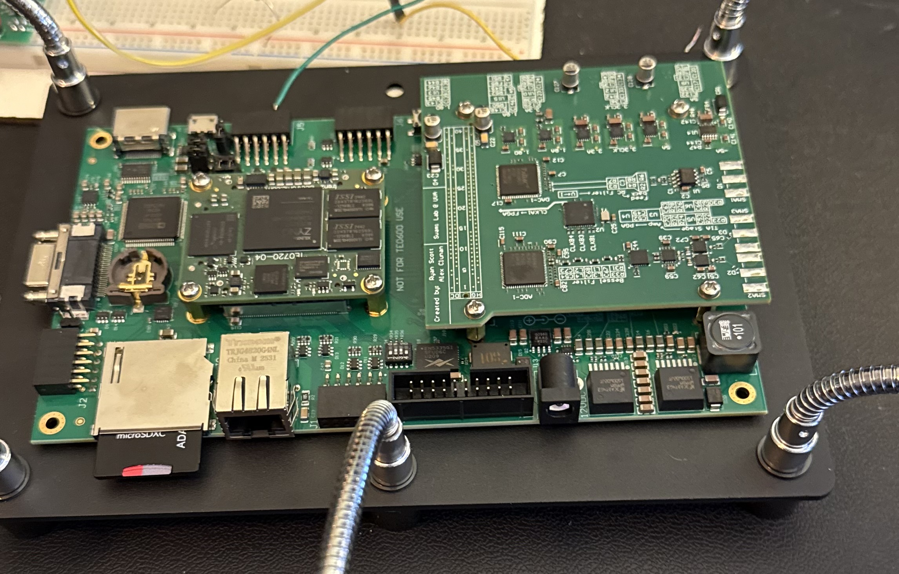
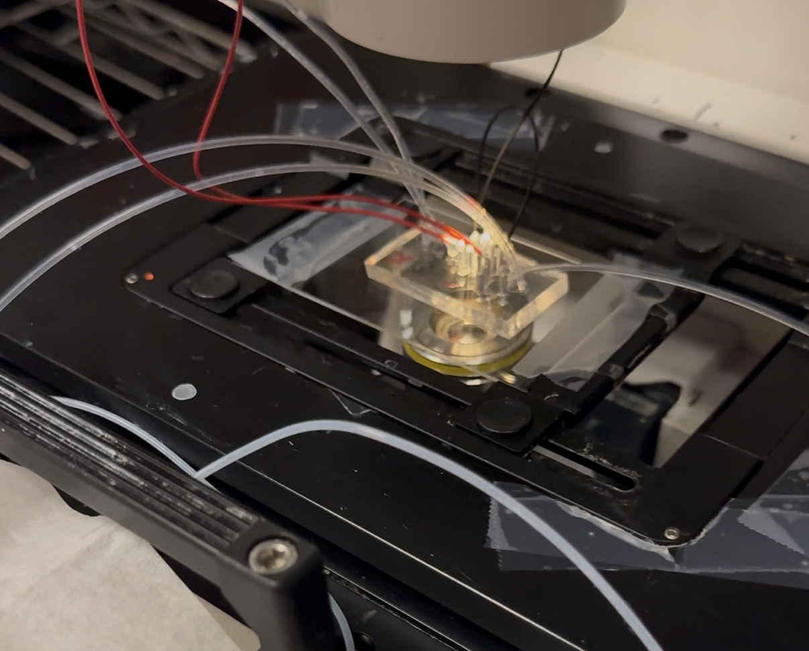
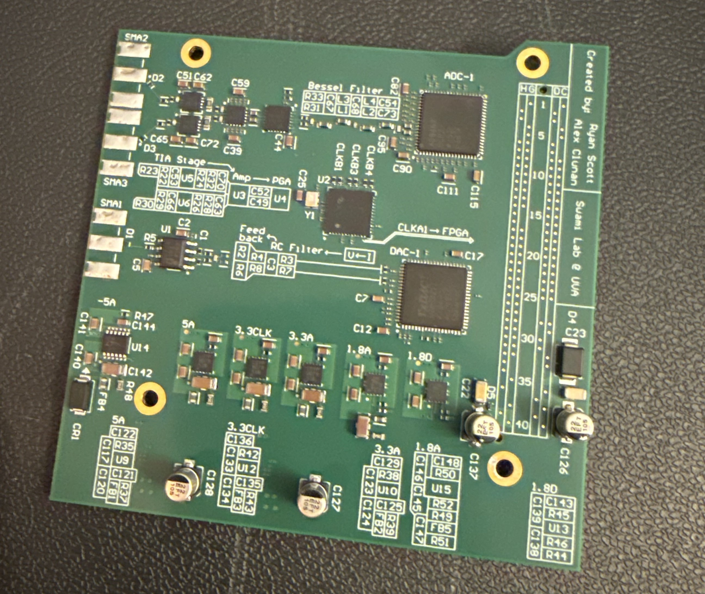

# FPGA Multi-Frequency Impedance Analyzer

This is a digital lock-in amplifier (DLIA) and low-latency triggering instrument built on
a Xilinx Zynq-7020 (Trenz TE0720 system-on-module). The module mounts on a Trenz
TE0701-06 carrier board, and a custom data-acquisition board carrying the analog
front end and data converters attaches to the carrier through an FMC connector.
The system generates a multi-frequency excitation signal, measures how a
biological sample responds to it, and drives a physical output the moment a target
cell is detected. The intended application is impedance cytometry: measuring and
sorting individual cells or beads as they flow through a microfluidic channel.

Built with the Biophysical Systems Lab at the University of Virginia.

## Overview

Impedance cytometry is a method for characterizing single cells by their
electrical properties, without staining or tagging them first. When a cell flows
through a narrow channel between two electrodes, it changes the electrical
impedance seen across those electrodes, and the magnitude of that change depends
on the cell's diameter, its membrane, and its internal composition. Because the
method requires no fluorescent dyes or antibodies, it is fast, low cost, and
gentle on the sample, which makes it suitable for medical diagnostics, drug
screening, and the isolation of rare cells such as circulating tumor cells from a
blood sample.

The signal produced by a single cell is small relative to the measurement
background. To resolve it, the instrument uses a lock-in amplifier: the electrodes
are driven with excitation tones at known frequencies, and only the response at
those exact frequencies is measured, which rejects most of the surrounding noise.
Driving several frequencies at once probes different structures within a cell.
Lower frequencies respond to the whole cell and its outer membrane, while higher
frequencies penetrate the membrane and sense the interior. Together they form an
electrical fingerprint that separates one cell type from another.

Sorting a cell requires detecting it and actuating a sorter while it remains
within the channel, a window on the order of a few milliseconds. A general purpose
computer running a standard operating system cannot guarantee a response within
that window, because process scheduling can introduce delays of milliseconds. This
instrument places the time-critical signal processing and the actuation inside the
FPGA fabric, where the logic executes on a fixed clock with deterministic and
repeatable timing. That property is what allows the actuation to occur within the
required window.

The design is organized into three layers.

- **Programmable logic (the FPGA fabric).** This layer performs all of the
  real-time signal processing. It carries out direct digital synthesis of the
  excitation signal, captures the returning samples from the ADC, demodulates them
  into per-frequency magnitude and phase across four parallel channels, filters
  and downsamples the result, packs it into a stream for transfer, and drives the
  trigger output at a precise, pre-computed time.
- **Processing system (the dual-core ARM Cortex-A9 running PetaLinux, a small
  embedded Linux).** This layer runs the `iza_replay` application, which moves the
  demodulated records off the fabric and out to the host over the network, answers
  configuration requests, replays recorded waveforms back through the analog path
  for testing, and runs the event-detection logic that decides when to fire.
  Because this layer is software, its behavior can be changed by recompiling and
  copying a single executable, without the lengthy FPGA rebuild that a fabric
  change requires.
- **Host PC.** This layer runs a graphical application and a set of command-line
  tools that configure the instrument, plot and record the live measurement
  stream, and set up and monitor triggering.

Every clocked part of the board is derived from one 200 MHz oscillator, and a
free-running 64-bit counter (one count every 10 nanoseconds) is stamped onto every
measurement record. Because the software and the fabric share that single time
base, the processor can specify an absolute time T for the output to assert, and
the fabric asserts it exactly at T. No separate clock on the host needs to be
synchronized against the instrument, which removes a common source of timing error
in systems that split work between a computer and dedicated hardware.

## Overall System

<div align="center">
  <br>
  <sub><b>System Diagram</b></sub><br><br>
  <table>
  <tr>
    <td></td>
    <td></td>
  </tr>
  <tr>
    <td align="center"><b>Combined Measurement Board</b></td>
    <td align="center"><b>Microfluidic Setup</b></td>
  </tr>
</table>
</div>


## Features

- Four-channel multi-frequency lock-in demodulation, producing a magnitude and
  phase reading for each excitation frequency in parallel.
- A configurable decimation stage (a CIC filter with a rate from 1000 to 8000) giving a demodulated output
  between 200 kHz and 25 kHz, followed by a reloadable FIR filter for the final
  shaping.
- Live filter reconfiguration. A filter can be designed by cutoff frequency in the
  GUI or supplied as a Xilinx coefficient file (`.coe`), and the coefficients are
  streamed to all four channels through a control register while the instrument
  runs. Optional compensation for the CIC filter's passband droop is included.
- Network interfaces over UDP for the measurement stream, for replaying a waveform
  from the host back into the board, for telemetry, for register and SPI control,
  and for reporting trigger events.
- A triggering engine that combines rolling-baseline peak detection with
  per-channel phase-window classification on the processor, and a jitter-free
  dual-output actuation in the fabric that fires at a pre-computed timestamp. It is
  designed to keep the decision latency, from acquisition to trigger, under
  5 milliseconds.
- A Python desktop application with a live oscilloscope view, large numeric
  readouts, a filter designer, a triggering tab that shows a live estimate of the
  system latency, and a register browser.
- Recording to the Zurich Instruments `ziBin` file format, with selectable
  decimation to keep file sizes manageable, so existing analysis scripts read the
  output without modification.

## Hardware

| Item | Value |
|---|---|
| Compute module | Trenz TE0720 (Xilinx Zynq XC7Z020CLG484-2) |
| Carrier board | Trenz TE0701-06 |
| Data-acquisition board | custom, 10 layers, attached to the carrier over an FMC connector |
| ADC | AD9467, 16-bit, 200 MSPS, LVDS |
| DAC | AD9122, 16-bit, byte-mode LVDS |
| Master clock | 200 MHz LVDS oscillator, fanned out to the ADC, DAC, and fabric |
| Analog front end | low-noise transimpedance stage, low noise amplifier, programmable-gain driver into the ADC |
| Trigger outputs | two LVCMOS25 actuation outputs |

## Custom data-acquisition board

The analog front end, data converters, clocking, and power regulation are on a
custom data-acquisition board that attaches to the Trenz TE0701-06 carrier through
an FMC connector. The design files are in `PCB/`:

- [`PCB/PCB Schematic.pdf`](PCB/PCB%20Schematic.pdf), the full schematic.
- [`PCB/PCB_BoM.csv`](PCB/PCB_BoM.csv), the bill of materials.


<div align="center">
  <br>
  <sub><b>Custom 10-layer PCB</b></sub><br><br>
</div>

Key components:

| Function | Part |
|---|---|
| ADC | AD9467BCPZ-200, 16-bit, 200 MSPS |
| DAC | AD9122BCPZRL, dual 16-bit TxDAC |
| DAC buffer amplifier | ADA4857-1, 850 MHz |
| Transimpedance and low-noise input amplifiers | ADA4817-1 (x2), 1.05 GHz |
| Low noise amplifier | ADA4938-1 |
| Programmable-gain ADC driver | LMH6881, 2.4 GHz with gain control |
| Clock oscillator | AK2ADDF1-200, 200 MHz LVDS |
| Clock fanout buffer | LMK00301, 3 GHz, 10-output differential |
| Power regulation | LTM8074 buck (x2), LT3045 ultra-low-noise LDO (x3), TPS7A9401 LDO (x2), LT3094 negative LDO |
| Connectors | ASP-134604-01 FMC to the carrier, three SMA edge connectors for analog I/O |

## Host software

The host application does not require the instrument to be present, so the
interface can be explored on its own. From the `pc/` directory:

```
python -m iza_gui
```

## Repository layout

| Path | Contents |
|---|---|
| `FPGA/` | Custom Verilog IP, the packaged IP repository, XDC constraints, `rebuild.tcl` (regenerates the Vivado project from version control), and the fabric specification |
| `FPGA/Custom Hardware Source Files/` | The authoritative RTL. Superseded modules are kept under `retired hardware/` |
| `pc/` | Host software: the `iza_gui` desktop application, the command-line tools, the shared protocol library, and the FIR designer |
| `petalinux_overlay/meta-user/` | PetaLinux recipes: the `dma-proxy` kernel module, the `iza-stream` application, the device tree, and the network configuration |
| `PCB/` | The data-acquisition board schematic (PDF) and bill of materials. The Altium source files are kept out of the repository |
| `Reference/` | AD9122 and AD9467 datasheets, TE0720 module documents, and connector pinouts |
| `Block Diagrams/` | Architecture figures |
| `docs/` | The maintained documentation set (see Documentation below) |
| `verification_plans/` | Earlier planning notes, kept for history and not authoritative |

## Wire protocol

All communication between the host and the board is UDP, with fields in
little-endian byte order. The complete byte-level specification is in the
Technical Reference Manual, chapter 3.

| Flow | Direction | Port |
|---|---|---|
| Measurement stream | board to host | 7100 |
| Waveform replay | host to board | 7200 |
| Telemetry | board to host | 7201 |
| Control (register and SPI) | host and board | 7202 |
| Trigger configuration | host to board | 7202 |
| Trigger events | board to host | 7203 |

## Documentation

The `docs/` tree is the maintained documentation set.

- `docs/reference-manual/` builds a typeset Technical Reference Manual with
  `latexmk -pdf trm.tex`. It covers the architecture, the signal chain and the
  theory behind it, the wire protocol, the register maps, and the hardware.
- `docs/guides/` holds task-oriented Markdown: an operator quick-start, the GUI
  and CLI references, the FPGA and firmware developer guides, a build-and-deploy
  guide, and a triggering guide.
- `docs/archive/` collects the older planning notes along with a manifest that
  maps each one to where it came from.

## License

See [LICENSE](LICENSE).

## Acknowledgements

Developed by Alex Clunan and Ryan Scott with the Biophysical Systems Lab at the University of Virginia as an ECE
capstone and follow-on research project. 
