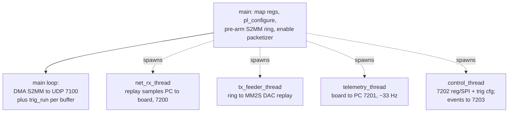

# Firmware Guide (PetaLinux / PS)

The Processing System runs PetaLinux. The userspace application `iza_replay`
streams demod records to the PC, serves the control channel, replays waveforms,
and runs trigger detection. This guide covers the recipes, the application's
thread model, converter init, and the build/deploy loop.

> **PetaLinux runs in a separate VM** that you operate — do not look for
> `petalinux-*` tools on the Windows host. Develop recipes/sources here and hand
> them to the VM through the shared folder.

## Yocto recipes (`petalinux_overlay/meta-user/`)

| Recipe | Path | What |
|---|---|---|
| `dma-proxy` (kernel module) | `recipes-modules/dma-proxy/` | coherent-buffer DMA, exposes `/dev/dma_proxy_{tx,rx}` |
| `iza-stream` (app) | `recipes-apps/iza-stream/` | the `iza_replay` streamer/control/trigger app (+ legacy `iza_stream`, `iza_dump`) |
| device tree | `recipes-bsp/device-tree/files/system-user.dtsi` | the `dma_proxy` DT node |

**dma-proxy** allocates DMA buffers with `dma_alloc_coherent` and mmaps them
non-cached, so stale-cache corruption is impossible by construction — there is no
manual cache management anywhere. The in-kernel `xilinx_dma` driver handles the
level-triggered S2MM/MM2S interrupts.

## `iza_replay.c` — thread model

`main()` maps the register file, configures the PL, pre-arms the S2MM ring, then
spawns four threads and runs the data path:



- **Data path (main loop).** Reads completed S2MM buffers from `dma_proxy_rx`,
  wraps them in `iza_pkt_hdr_t`, and sends UDP datagrams on port 7100. Calls
  `trig_run()` on each buffer for inline detection.
- **`net_rx_thread`** receives replayed int16 samples (port 7200) into a ring;
  **`tx_feeder_thread`** pops the ring into the MM2S channel to drive the DAC
  replay path; **`telemetry_thread`** reports ring fill/rate (port 7201) so the
  PC can servo its send rate.
- **`control_thread`** serves the control port (7202): it branches on the magic —
  `IZA_CMAGIC` for register/SPI transactions, `IZA_GMAGIC` for a trigger-config
  datagram. Trigger events are streamed out on port 7203.

Key helpers: `regfile_map` (mmap `0x43C00000`), `pl_configure`,
`pl_packetizer(enable)`, `ring_push`/`ring_pop_fill`, and the trigger block
(`trig_apply_cfg`, `trig_run`, `trig_fire`, `trig_emit`, `trig_test_fire`).

## Trigger detection (PS)

`trig_run()` runs per DMA buffer: it maintains a per-channel leaky-integrator
baseline, does bipolar peak detection on the baseline-subtracted magnitude,
classifies phase against per-channel windows, and — on a pass — computes the
actuation delay (fixed or velocity) and writes the fire command (`T`, `W`, strobe)
to the spare AXI registers for `trigger_engine`. A watchdog auto-disarms if the
PC control heartbeat goes quiet. In soft mode it streams events without driving a
pin. Details and tuning: `triggering-guide.md`; wire format: TRM ch. 3.

## Converter init (SPI over EMIO)

The converters are on PS-SPI via EMIO through Linux spidev: AD9122 DAC on
`/dev/spidev1.0` (4-wire), AD9467 ADC on `/dev/spidev0.0` (3-wire). Actual init
sequences run from the PC via `iza_ctrl.py dac-init` / `adc-init` (TRM ch. 4).
**The DAC chip must be released (`run` first) before its SPI path is alive**, and
both converters need init after every power cycle or they emit garbage.

## Register-write safety

Never write the DMA-fragile framing registers (channel enables reg 2, packet
config reg 4) mid-stream — it chops an S2MM transfer and hangs `dma_proxy`. The
firmware and `iza_ctrl.reset_all()` drop `run` first (graceful `TLAST`), wait,
then reconfigure. Trigger fire commands use spare registers only, so they are
safe to write while streaming.

## Build and deploy

Fast iteration — recompile just the app and copy the ELF to the running board:

```bash
petalinux-build -c iza-stream -x do_compile
scp -o StrictHostKeyChecking=no \
    <build>/.../iza_replay root@192.168.0.80:/usr/bin/
```

Full image / bitstream change (new `.xsa`):

```bash
petalinux-build
petalinux-package --boot --fsbl --fpga --u-boot --force
# copy BOOT.BIN + image.ub to the SD card, boot
```

Board access: `root@192.168.0.80`, always `-o StrictHostKeyChecking=no`.

## Boot-time checks

```bash
dmesg | grep -i 'xilinx.*dma'     # xilinx_dma probe, 2 channels
dmesg | grep dma_proxy            # coherent buffer alloc
ls /dev/dma_proxy_*               # both nodes present
```
