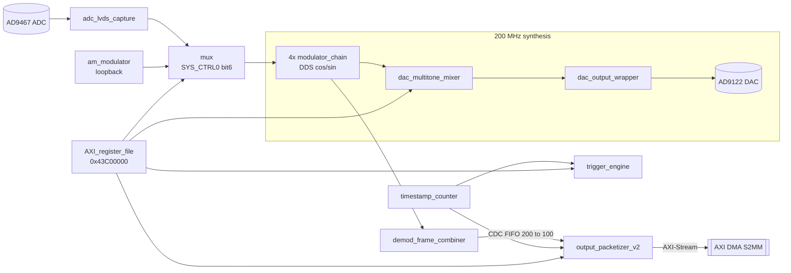

# FPGA Developer Guide

The programmable logic holds the whole real-time signal chain. This guide covers
the Vivado projects, the block design, the custom module set, the build flow, and
repository hygiene. The theory of each stage is in the Technical Reference Manual,
ch. 2; the register map is ch. 4.

## Projects

| Project | Path | Contains |
|---|---|---|
| Top design | `impedance_analyzer_vivado/` | `full_design.bd` — the whole instrument |
| Demod sub-IP | `modulator_chain_vivado/` | `modulator_chain.bd` — one DDS + quadrature demod chain, packaged as IP |
| Custom RTL | `FPGA/Custom Hardware Source Files/` | the hand-written Verilog (authoritative) |

`full_design.bd` is the authoritative hardware description. `modulator_chain` is
instantiated four times (one per frequency channel) and is built from Xilinx DSP
IP (CORDIC, CIC Compiler, DDS Compiler, FIR Compiler, mult_gen) — **not** the
hand-rolled DSP `.v` files, which were superseded (see *Retired modules*).

## Block design contents

The top BD instantiates these custom module references plus two user IP
(`alexclunan.com:user:AXI_register_file` and `:modulator_chain`):

```
adc_bit_reorder   adc_fifo_read   adc_lvds_capture   am_modulator
dac_multitone_mixer   dac_output_wrapper   demod_frame_combiner   mux
output_packetizer_v2   reset_manager   sample_hold   spi_rd_tristate
timestamp_counter   trigger_engine
```

Data flow (see TRM ch. 2 for detail):



## Register file

Sixteen 32-bit registers in `AXI_register_file` at `0x43C00000` (TRM ch. 4).
Writes come from the PS (`iza_replay.c`) over the control channel; the file is
write-through with a PS shadow copy. Spare registers 9–15 carry the trigger
engine's fire commands.

## Build flow (bitstream → boot)

1. Edit RTL in `FPGA/Custom Hardware Source Files/`.
2. **Sync the Vivado import copies.** Vivado compiles *copies* of sources under
   `…srcs/sources_1/imports/…`, not the files you edit in the GitHub tree.
   Re-import (or copy over) the changed `.v` after every edit, or synthesis will
   silently use the stale copy.
3. Regenerate output products for any changed module reference / the BD.
4. Generate bitstream → export hardware (**include bitstream**) to `.xsa`.
5. Hand the `.xsa` to the PetaLinux VM; rebuild BOOT.BIN
   (`petalinux-package --boot --fpga …`). See `firmware-guide.md`.

> **Stale-bitstream trap.** FPGA-side changes need a fresh `BOOT.BIN`. If
> behavior doesn't change after an RTL edit, check the *running* bitstream before
> chasing it in software.

## Constraints / pins

`impedance_analyzer_vivado.srcs/constrs_1/new/`:
`dac_test_constraints.xdc` (I/O incl. the trigger pins **AA7** main / **AA6**
secondary, LVCMOS2.5), `timing.xdc`, `implementation_fixes.xdc`.

## Retired modules

These 18 modules have **zero live instantiations** in the current design
(verified against `full_design.bd` + `modulator_chain.bd` and by grepping every
active module for instantiations). They are superseded by the v2 modules or by
Xilinx IP inside `modulator_chain`, and belong in
`FPGA/Custom Hardware Source Files/retired hardware/`:

| Module | Superseded by |
|---|---|
| `output_packetizer.v` | `output_packetizer_v2.v` |
| `trigger_logic.v` | `trigger_engine.v` |
| `state_machine.v` | (legacy control FSM) |
| `mag_phase_calculator.v` | CORDIC IP (in `modulator_chain`) |
| `decimator_lpf_wrapper.v` | CIC Compiler IP |
| `lock-in_mixer.v`, `mixer.v` | DDS + mult_gen IP |
| `phase_accumulator.v`, `phase_accumulator_aligner.v`, `phase_accumulator_slave.v`, `phase_adjuster.v`, `phase_synchronizer.v` | DDS Compiler IP |
| `running_mean_subtractor.v` | (unused) |
| `path_delay_calibration.v` | (unused) |
| `DAC_driver_top.v` | `dac_output_wrapper.v` + SelectIO IP |
| `adc_data_realignment.v`, `adc_fifo_write.v`, `adc_input_selectio_wiz.v` | current ADC capture path / SelectIO IP |

> **Not retired:** `reset_sync.v` — it is instantiated four times inside the
> active `reset_manager.v`. Keep it.
>
> Before moving, remove any of these that Vivado still lists as *source files*
> from the project (Sources → right-click → Remove), or Vivado will flag them
> missing. Keep each module's testbench with it.

## Reloadable FIR coefficients

The demod FIR (127-tap, 16-bit, **symmetric/linear-phase**) supports live
coefficient reload from the PC. Chain: PC (`.coe` / cutoff) → `iza_ctrl.fir_load`
→ **REG3** → `fir_coeff_loader.v` → FIR Compiler `S_AXIS_RELOAD` + `S_AXIS_CONFIG`.

**RTL:** `fir_coeff_loader.v` stages coefficients into a RAM and, on commit,
streams them into **four identical reload masters** (`m_axis_reload0..3`, `tlast`
on the last coefficient) then pulses **four config masters** (`m_axis_config0..3`)
— one loader drives all four chains with the same coefficients. Each channel has
its own `tvalid`/`tready` (a per-channel accepted mask tolerates handshake skew;
for identical FIRs it's single-cycle beats). REG3 command word: `[15:0]` coeff,
`[17:16]` opcode (0 nop / 1 reset / 2 push / 3 commit), `[31]` strobe toggle
(flipped each write so identical values still register). It runs in the FIRs'
200 MHz `aclk`; the toggle crosses from the 100 MHz control domain via a 2-FF
synchronizer (data bits are quasi-static — UDP writes are ms apart).

**Manual Vivado steps (not done in software):**
1. Regenerate the FIR Compiler IP with **Coefficient Reload = ON** and
   **Coefficient Structure = Symmetric** (halves DSPs *and* reload length). Note
   the exact **reload length** — for a symmetric 127-tap it's `(127+1)/2 = 64`.
2. **Verify the reload coefficient ORDER against PG149** for your IP options and
   set `fir_coeff_loader`'s `NCOEF` to match (default 64). `fir_design.reload_set`
   sends ascending-index order (the common case); adjust if PG149 differs.
3. Expose each `modulator_chain` FIR's `S_AXIS_RELOAD` + `S_AXIS_CONFIG` up to the
   `modulator_chain` boundary, then instantiate **one** `fir_coeff_loader` at the
   top level: connect `reg3` to the register file's REG3 output and its four
   `m_axis_reload0..3` / `m_axis_config0..3` masters to the four chains' FIRs
   (shared coefficients across all four). The `m_axis_*` port names let Vivado
   infer the AXI-Stream interfaces automatically.
4. Re-package `modulator_chain`, regenerate, rebuild the bitstream (stale-bitstream
   trap). REG3 (`0x0C`) is otherwise unused, so software is forward-compatible —
   loading does nothing until this bitstream is running.

**Software (already implemented, pure PC):** `iza_ctrl.py fir-design <cutoff>` /
`fir-load <file.coe>`, the `IzaCtrl.fir_load()` method, the designer
`fir_design.py`, and the GUI **Control → FIR filter** section (cutoff spinbox +
`.coe` upload). See `cli-reference.md` and `gui-user-guide.md`.

## Repository hygiene

- **`impedance_analyzer_vivado.xpr` references external paths.** It points its BD
  source, HDL wrapper, IP output repo, and sim-lib caches at
  `C:\impedance_linux\impedance_analyzer`. After a clean clone the project will
  not build until those are repathed. Fix: open the authoritative project in
  Vivado and **File → Project → Save As…** into the repo (copy sources), or
  `write_project_tcl -paths_relative_to`, so the paths become local.
- **Do not commit generated output.** Add a Vivado `.gitignore`:

  ```gitignore
  *.cache/
  *.gen/
  *.runs/
  *.ip_user_files/
  *.hw/
  *.sim/
  .Xil/
  *.jou
  *.log
  ```

  Keep sources under version control: `*.srcs/`, `*.xpr`, `ip_repo/`, `*.coe`,
  and the `bd/` source. The stale `Vivado Project/` folder should be untracked
  (it carries committed `.dcp`/netlist artifacts).
