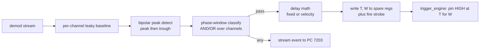

# Triggering Guide

The trigger system detects a target event (a cell/bead transiting the sensor) in
the demod stream and fires a physical actuation pin to sort it. Detection runs on
the PS; the output edge is driven deterministically by the PL. This guide
explains the mechanism and how to configure it. Wire format: TRM ch. 3, §5;
firmware internals: `firmware-guide.md`.

## How it works



1. **Baseline.** Each channel's complex demod output feeds a leaky-integrator
   baseline (`baseline_shift` sets the time constant; larger = slower).
2. **Amplitude detection.** On the baseline-subtracted magnitude of the chosen
   `amp_channel`, the firmware looks for a **bipolar peak** — a peak then a trough
   (or trough then peak, per `polarity`). It arms when the excursion exceeds
   `amp_threshold` and fires when the peak-to-trough difference exceeds
   `min_peak_diff`, within `event_ticks`. `holdoff_ticks` debounces re-fires.
3. **Phase classification.** At detection, each channel in `phase_mask` is rotated
   to its calibrated `phase_mean` and tested against its `[phase_lo, phase_hi]`
   window; the per-channel results are combined by `combine` (AND/OR). This is the
   live/dead (in-window) decision.
4. **Delay.** *Fixed:* `T = peak_ts + fixed_delay_ticks`. *Velocity:* measure the
   transit time between the two peaks (`dt_ticks`), scale by `distance_ratio`, add
   `lead_offset_ticks`. All in 5 ns counts.
5. **Fire.** The PS writes `T` and pulse width `W` (and, for the second actuator,
   `T1 = T0 + pair_delay`, width `pulse_width2`) to the spare registers and pulses
   the fire strobe. `trigger_engine` drives the pin(s) HIGH exactly at each `T`.

Every event — pass or candidate — is streamed to the PC (port 7203) with full
timing (peak ts, transit Δt, computed delay, commanded and actual fire ts, and
detection latency) for the GUI log.

## Modes

| Mode | Meaning |
|---|---|
| `OFF` | disarmed |
| `SOFT` | PS detects and streams events, **no pin** — use for bring-up/tuning |
| `HW` | PS detects, PL fires the physical pin (needs the Stage-2 bitstream) |

## Latency

Detection/decision budget: soft 1 ms, hard 5 ms. Reduce `records_per_packet` in
trigger mode (~64–128) so a completed peak is seen well inside 1 ms. The intended
actuation delay (fixed/velocity, up to hundreds of ms) is separate and is
realized jitter-free by the PL — it is not part of the latency budget.

## Configuring from the CLI

Soft (no-pin) arming for bring-up:

```bash
python iza_ctrl.py --board 192.168.0.80 trig-soft \
    --ampch 0 --thr 0.02 --mindiff 0.03 --shift 12 \
    --holdoff 0.050 --event 0.050 --fixed-delay 0.0 --pulse 0.001
python iza_ctrl.py --board 192.168.0.80 trig-off   # disarm
```

Thresholds `--thr`/`--mindiff` are fractions of full scale (converted to
`fix32_30`); the time options are seconds (converted to 5 ns ticks). Watch events
on UDP 7203 (the GUI Triggering tab decodes them).

## Configuring from the GUI

The **Triggering** tab exposes all of the above with live feedback: mode/arm, the
safety watchdog (auto-disarm timeout), **test-fire** buttons (fire the outputs a
few ms out, independent of detection), amplitude thresholds (shown in raw counts
with %FS hints, overlaid on the Scope plot), per-channel phase windows,
fixed/velocity timing, the event log + run statistics, and load/save of a
calibration JSON (phase means and windows). It auto-disarms on link loss.

## Bench checkout

- `test-fire` (GUI) or `trig-soft` + manual `IZA_OP_TRIG_TEST` verifies the pin
  and wiring without a real event.
- In HW mode, scope-probe **AA7** (main) / **AA6** (secondary); confirm the edge
  lands at the commanded `T` (within one 100 MHz count) and the width matches `W`.
